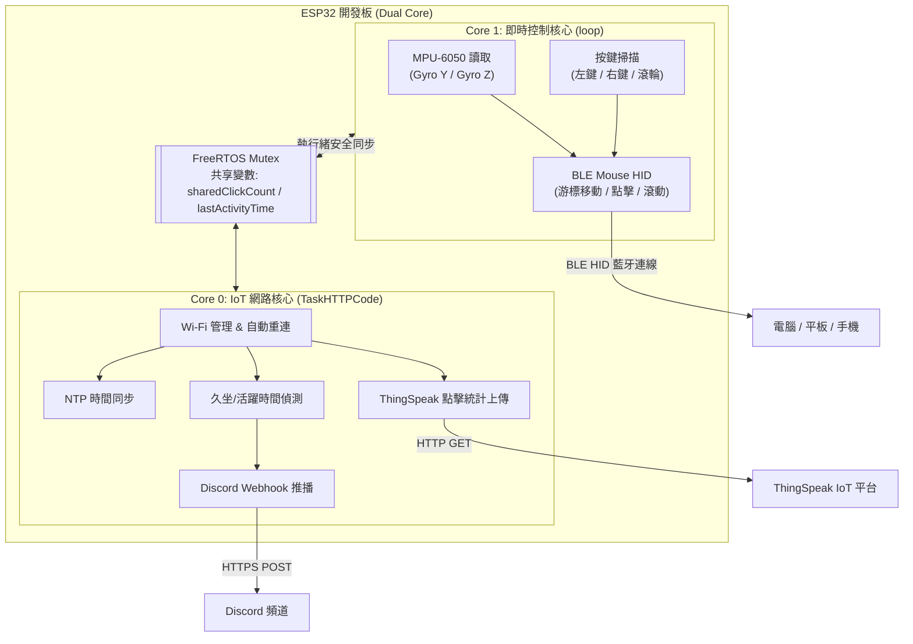

# ESP32 BLE 陀螺儀空中滑鼠 (ESP32 BLE Gyro Air Mouse with IoT Health Tracking)

[](https://www.espressif.com/)
[](https://www.arduino.cc/)
[](https://www.freertos.org/)
[](LICENSE)

基於 ESP32 與 MPU-6050 六軸感測器實現的低功耗藍牙 (BLE) 體感空中滑鼠。  
本專案採用 FreeRTOS 雙核心多工架構，在確保游標即時流暢低延遲的同時，非同步整合 ThingSpeak 雲端點擊數據統計與 Discord Webhook 久坐/長時間使用提醒，打造兼具實用性與健康關懷的智慧物聯網 (IoT) 滑鼠。

---

## 核心特色

1. **體感空中滑鼠 (BLE Air Mouse)**
   - 透過 MPU-6050 陀螺儀偵測手腕運動，直覺式控制游標移動。
   - 支援滑鼠左鍵、右鍵以及專屬滾輪模式按鍵（按住時晃動即可滾動頁面）。
   - 內建 Deadzone 過濾與靈敏度調整，有效防止微小手震引發的游標漂移。

2. **FreeRTOS 雙核心並行運作 (Dual-Core Architecture)**
   - **Core 1 (即時滑鼠任務)**：專責 MPU-6050 姿態更新、按鍵去抖動與 BLE HID 滑鼠訊號發送，保證超低延遲不卡頓。
   - **Core 0 (IoT 背景任務)**：非同步處理 Wi-Fi 連線、NTP 網路對時、ThingSpeak 數據上傳與 Discord Webhook 推播，完全不干擾滑鼠操控體驗。
   - 使用 FreeRTOS Mutex 互斥鎖 (`xMutex`)，確保跨核心共享變數的線程安全。

3. **健康久坐提醒 (Discord Webhook Alert)**
   - 追蹤使用者活動狀態（偵測游標移動與點擊事件）。
   - 當偵測到使用者連續使用電腦超過設定時間（程式碼內可自由設定，預設示範為連續使用達閥值），自動發送 Discord 訊息提醒休息。
   - 具備 3 次重試機制與 SSL 連線優化。

4. **ThingSpeak 雲端數據統計**
   - 定時（每 60 秒）統計滑鼠點擊次數並上傳至 ThingSpeak IoT 平台，便於分析個人工作習慣與電腦使用頻率。

---

## 系統架構圖



---

## 硬體需求與接線說明

### 1. 硬體清單
- **ESP32 開發板** (如 ESP32-WROOM-32 / NodeMCU-32S)
- **MPU-6050** 六軸感測器模組 (I2C 介面)
- **輕觸微動按鍵** x 3 (左鍵、右鍵、滾輪切換鍵)
- 麵包板與杜邦線若干

### 2. 接線腳位表 (Pinout)

| 模組 / 元件 | 引腳 (Module Pin) | ESP32 GPIO | 說明 |
| :--- | :--- | :--- | :--- |
| **MPU-6050** | VCC | 3.3V | 電源正極 (建議使用 3.3V) |
| | GND | GND | 接地 |
| | SCL | **GPIO 22** | I2C 時脈線 |
| | SDA | **GPIO 21** | I2C 資料線 |
| **按鍵 (左鍵)** | PIN | **GPIO 16** | 內建上拉電阻，按下時接地 (LOW) |
| **按鍵 (右鍵)** | PIN | **GPIO 17** | 內建上拉電阻，按下時接地 (LOW) |
| **按鍵 (滾輪模式)** | PIN | **GPIO 4** | 內建上拉電阻，按下時接地 (LOW) |

> **按鍵接線提示**：三個按鍵皆使用 ESP32 內部上拉電阻 (`INPUT_PULLUP`)，按鈕一端接對應的 GPIO，另一端直接接 ESP32 的 GND 即可，無需外接上拉電阻。

---

## 軟體開發環境與函式庫安裝

### 開發環境
- [Arduino IDE](https://www.arduino.cc/en/software) (建議 2.0 以上版本) 或 PlatformIO。
- 請先安裝 ESP32 開發板支援包（由 Espressif 開發）。

### 必備函式庫 (Libraries)
請於 Arduino IDE 的「工具」->「管理程式庫 (Library Manager)」中搜尋並安裝以下套件：
1. **[MPU6050_light](https://github.com/rfetick/MPU6050_light)** (by Romain Fetick) - 輕量、快速校準的 MPU-6050 函式庫。
2. **[ESP32-BLE-Mouse](https://github.com/T-Party/ESP32-BLE-Mouse)** (by T-Party) - ESP32 模擬藍牙 BLE 滑鼠 HID 函式庫。
3. **內建函式庫** (隨 ESP32 核心支援包提供，無需另外安裝)：
   - `Wire.h` (I2C 通訊)
   - `WiFi.h`、`HTTPClient.h`、`WiFiClientSecure.h` (網路通訊)
   - `time.h` (時間校正)

---

## 專案設定與使用指南

### 1. 修改設定參數
開啟 [`main.c`](file:///c:/Users/wangl/Downloads/Github_Readme%E6%92%B0%E5%AF%AB/gyro-mouse-ble-main/gyro-mouse-ble-main/main.c)，找到最上方的「使用者設定」區段進行配置：

```cpp
// --- 使用者 Wi-Fi 與金鑰設定 ---
const char* ssid = "YOUR_WIFI_SSID";             // Wi-Fi 名稱
const char* password = "YOUR_WIFI_PASSWORD";     // Wi-Fi 密碼
String myWriteAPIKey = "YOUR_THINGSPEAK_API_KEY";// ThingSpeak Write API Key
const char* discord_webhook_url = "https://discord.com/api/webhooks/..."; // Discord Webhook URL
```

### 2. 靈敏度與死區調校 (可選)
可根據個人操控手感與螢幕解析度調整下列巨集參數：

```cpp
#define SENSITIVITY_X 10      // 游標 X 軸靈敏度 (數值愈小愈靈敏)
#define SENSITIVITY_Y 10      // 游標 Y 軸靈敏度 (數值愈小愈靈敏)
#define SENSITIVITY_SCROLL 40 // 滾輪滾動靈敏度
#define DEADZONE 3            // 死區濾波閥值 (手震抑制)
```

### 3. 久坐/超時使用提醒時間調整 (可選)
在 `TaskHTTPCode` 任務中：
```cpp
// 預設連續活動達 60,000 毫秒 (1 分鐘) 即發送警報 (示範用)
// 若要設定為 45 分鐘，可改為 45 * 60 * 1000 = 2700000
if (currentMillis - sessionStartTime > 60000) {
    // 發送 Discord 提醒...
}
```

---

## 燒錄與操作步驟

1. **燒錄程式**：
   - 將 ESP32 透過 USB 連接至電腦。
   - 在 Arduino IDE 中選擇對應的 ESP32 開發板型號與 COM Port。
   - 點擊「上傳 (Upload)」。
2. **感測器校準 (重要注意事項)**：
   - 開機或重開機時，請將裝置水平靜置於桌面上約 2 秒鐘。
   - 看到 Serial Monitor 顯示 `MPU Ready!` 後即校準完成，可拿起開始使用。
3. **藍牙配對**：
   - 開啟電腦、筆電、平板或手機的藍牙搜尋。
   - 尋找名為 `Mouse` 的藍牙裝置並進行配對。
   - 配對成功後即可開始以手勢移動控制游標。
4. **操作方式**：
   - **游標移動**：握持感測器，手腕上下、左右揮動。
   - **滑鼠左鍵**：按壓 GPIO 16 鍵。
   - **滑鼠右鍵**：按壓 GPIO 17 鍵。
   - **滾輪模式**：按住 GPIO 4 滾輪鍵不放，同時手腕上下揮動，即可進行網頁或文件滾動。

---

## 常見問題 (FAQ)

<details>
<summary><b>Q1: 游標有慢慢自動飄移 (Drift) 的情況怎麼辦？</b></summary>
MPU-6050 在開機時會執行 <code>mpu.calcOffsets()</code> 計算靜態補償偏移量。請確保每次重新啟動裝置時，裝置有水平平放於桌面上靜置 2 秒。若手震較明顯，亦可適度調大 <code>DEADZONE</code>（例如從 3 調至 5）。
</details>

<details>
<summary><b>Q2: 電腦藍牙搜尋不到名為 "Mouse" 的裝置？</b></summary>
1. 確認 ESP32 供電是否充足。<br/>
2. 打開 Serial Monitor (115200 baud) 查看是否停在 <code>MPU Init Failed</code>，若感測器接線鬆脫會停止啟動 BLE。<br/>
3. 若之前配對過，請先在電腦端移除該裝置後再重新搜尋配對。
</details>

<details>
<summary><b>Q3: Discord Webhook 提醒無法送出？</b></summary>
1. 檢查 Serial Monitor 是否有成功連上 Wi-Fi (<code>Connected!</code>)。<br/>
2. 確認 <code>discord_webhook_url</code> 網址是否正確完整。<br/>
3. 程式碼已設定 <code>client->setInsecure()</code> 跳過 SSL 憑證驗證，若 HTTP 回應碼為 <code>400</code> 或 <code>404</code> 請檢查 Webhook URL 是否失效。
</details>

---

## 授權條款 (License)

本專案採用 [MIT License](LICENSE) 授權開放原始碼。歡迎自由修改、分發與用於個人或商業專案。
